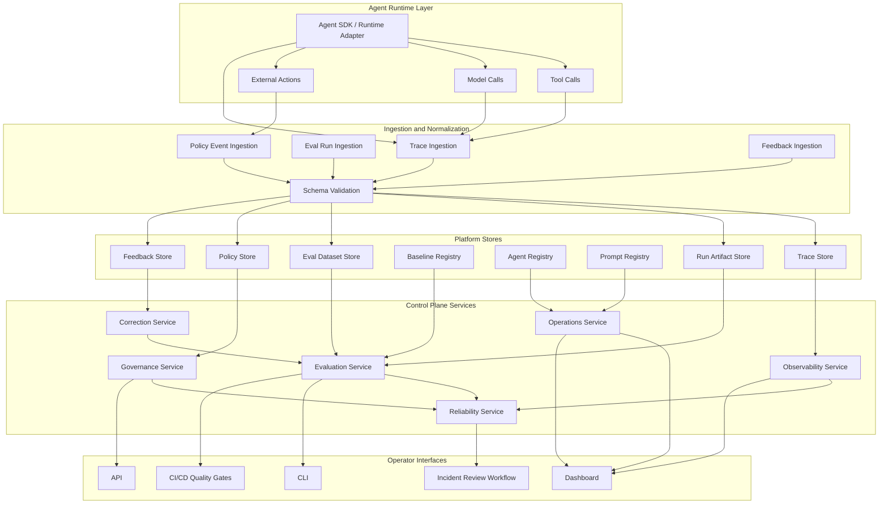

# AI Agent Control Plane Portfolio Strategy

## Executive Positioning

The portfolio should present a unified AI infrastructure system, not a set of unrelated demos.

The anchor project is the **AI Agent Control Plane**: a production-oriented platform for operating, monitoring, evaluating, governing, and improving AI agents.

The design philosophy is **ECC**:

- **Evaluate:** measure agent quality, regressions, latency, cost, safety, and reliability.
- **Control:** provide observability, governance, approvals, policy enforcement, and operational boundaries.
- **Correct:** capture failures, feedback, corrections, incident learnings, and improvement loops.

ECC is not a separate product. It is the platform design lens used to explain why each capability exists.

## Current Repository Read

The current repo is named `agent-reliability-platform` and implements a CLI-first vertical slice:

- Versioned eval case and suite schemas.
- Deterministic graders.
- End-to-end suite execution against a sample agent.
- Machine-readable run artifacts.
- Per-case attempt artifacts.
- Timing metadata.
- Error capture for agent and grader failures.
- Baseline promotion.
- Regression comparison.
- Human-readable failure reports.
- Unit and CLI tests covering schema validation, runner behavior, baseline comparison, and command flow.

This is already a strong seed for the Evaluation and Reliability portions of the control plane. It should be positioned as **the offline reliability gate** inside a larger AI Agent Control Plane.

## Unified Architecture

The platform should be described as a layered control plane around agent runtime execution.



## Capability Map To ECC

| Capability Area | Evaluate | Control | Correct |
| --- | --- | --- | --- |
| Evaluation | Offline evals, dataset evals, deterministic checks, LLM judges, prompt comparison, regression tests, quality metrics | CI gates, release thresholds, baseline promotion rules | Failure analysis, dataset expansion, grader calibration, prompt/model rollback decisions |
| Observability | Latency, cost, error rates, tool success rates, trace-level quality signals | Agent tracing, logs, metrics, OpenTelemetry integration, run inspection | Trace-to-eval conversion, incident replay, debugging workflows |
| Reliability | SLA/SLO checks, regression comparison, failure rate trends, retry/fallback effectiveness | Circuit breakers, retry budgets, fallback policies, rollout gates | Incident analysis, recovery playbooks, reliability experiments |
| Governance | Risk scores, policy violation rates, approval outcomes | Human approval workflows, policy engine, guardrails, action constraints | Policy tuning, reviewer feedback, new safety evals from violations |
| Operations | Usage, cost, latency, capacity, version adoption, model/provider comparisons | Agent registry, prompt registry, version management, quotas, budget controls | Cost optimization, deprecation plans, prompt/model lifecycle improvements |

## What Is Already Covered

### Strongly Covered In The Current Repo

- **Evaluation:** eval case schema, suite schema, deterministic graders, pass/fail scoring, suite execution.
- **Regression Testing:** baseline promotion and comparison detect when a previously passing case now fails.
- **Run Artifacts:** `run.json`, per-case attempt JSON, comparison JSON, and `report.txt`.
- **Explainability:** failed checks include expected value, actual value, and evidence.
- **Basic Observability:** run and attempt start time, completion time, duration, and status.
- **Reliability Foundation:** errored runs are captured instead of disappearing, and failures can block release via exit codes.
- **CLI Quality Gate:** commands can be used locally or in CI.
- **Testing Discipline:** schema, runner, baseline, and CLI flows are covered by tests.

### Covered Conceptually By Your Existing Project Portfolio

- **LLM Evaluation Platform:** maps to Evaluation and the first half of Correct.
- **Agent Observability Platform:** maps to Observability and Control.
- **Agent Reliability Platform:** the current repo bridges Evaluation and Reliability by turning evals into release gates.

### Not Yet Covered Or Only Lightly Covered

- **Production trace ingestion:** no OpenTelemetry collector, trace schema, or runtime adapter yet.
- **Real agent integration:** current runner supports only the built-in sample agent.
- **Governance workflows:** no policy engine, risk scoring, approval queue, or action enforcement.
- **Operations layer:** no registry for agents, prompts, model versions, costs, or usage analytics.
- **Correction loop:** no workflow to convert failures, feedback, incidents, or traces into new eval cases.
- **Reliability controls:** no retry policies, circuit breakers, fallback routing, SLOs, or incident workflow.
- **Persistence layer:** artifacts are file-based, which is excellent for v1 but not enough for platform-scale querying.
- **API and dashboard:** the current surface is CLI-first.

## Biggest Gaps

1. **Runtime integration gap**

   The system evaluates a sample agent, but Staff-level AI infrastructure interviews will expect a credible story for integrating real agents through adapters, contracts, and telemetry.

2. **Trace-to-eval gap**

   Observability becomes much more powerful when real traces can be promoted into eval cases. This is the cleanest bridge between your Agent Observability Platform and LLM Evaluation Platform.

3. **Governance gap**

   Governance is the most visibly missing capability area. A policy decision log, risk scoring contract, and human approval workflow would make the platform feel like an operational control plane rather than an eval-only tool.

4. **Operations metadata gap**

   Staff-level platform work needs registries and lifecycle management: agents, prompts, model versions, baselines, policies, datasets, and owners.

5. **Reliability engineering gap**

   The repo already catches errors and regressions, but it does not yet model SLOs, retry budgets, fallback policies, incident workflows, or release safety.

## Recommended Next Three Implementation Phases

### Phase 1: Unify Evaluation And Observability Around A Shared Run Schema

Goal: make the current repo the canonical offline reliability gate and prepare it for trace ingestion.

Build:

- Agent run schema that includes spans, model calls, tool calls, external actions, latency, cost, tokens, status, and errors.
- Adapter interface so `sample` is only one implementation, not the whole runtime.
- Import path from observed traces into eval run artifacts.
- OpenTelemetry-shaped trace IDs, span IDs, parent IDs, and attributes, even if storage remains local.
- CLI commands:
  - `agent register`
  - `run --agent-adapter`
  - `trace import`
  - `trace inspect`
  - `eval from-trace`

Staff-level signal:

- Shows contract-first platform thinking.
- Demonstrates schema evolution.
- Connects observability to evaluation.
- Preserves the disciplined CLI-first v1.

### Phase 2: Add Governance And Operational Control

Goal: show that the platform can control agent behavior, not just observe it afterward.

Build:

- Policy schema for external actions, tool use, data sensitivity, cost ceilings, and risk levels.
- Policy evaluator that emits allow, deny, require_approval, or warn decisions.
- Approval artifact workflow for high-risk external actions.
- Agent registry with owner, environment, version, model, prompt version, and policy bundle.
- Prompt registry with version, changelog, owner, and linked eval suite.
- CLI commands:
  - `policy validate`
  - `policy evaluate`
  - `approval request`
  - `approval decide`
  - `agent list`
  - `prompt promote`

Staff-level signal:

- Demonstrates governance primitives.
- Adds human-in-the-loop control without pretending to be a startup product.
- Creates auditable decision records.

### Phase 3: Add Reliability Operations And Correction Loops

Goal: make the platform continuously improve agents from production evidence.

Build:

- SLO definitions for latency, error rate, tool failure rate, eval pass rate, and cost.
- Reliability reports grouped by agent, version, prompt, suite, and policy.
- Incident artifact schema linking traces, failed evals, policy decisions, and remediation.
- Correction workflow that turns failures into new eval cases.
- Baseline history with superseded baselines and release notes.
- CLI commands:
  - `slo evaluate`
  - `incident open`
  - `incident attach-run`
  - `correction create-case`
  - `baseline history`
  - `release gate`

Staff-level signal:

- Shows reliability engineering applied to AI systems.
- Makes Correct real, not just a slogan.
- Turns production failures into durable platform learning.

## Roadmap

### 3-Month Roadmap

Theme: make the current repo a polished platform vertical slice.

Outcomes:

- Rename or position the repo clearly as `agent-control-plane` or keep `agent-reliability-platform` as the reliability gate component.
- Add architecture docs and README positioning.
- Add adapter interface for agents.
- Add unified run and trace schema.
- Add trace import and trace inspection commands.
- Add agent registry v1.
- Add prompt registry v1.
- Add CI example showing eval regression gates.
- Add richer sample eval suites covering tool misuse, external action prevention, latency budget, and error handling.
- Add a `docs/interview-walkthrough.md` explaining design decisions and tradeoffs.

Interview story:

> I started with a CLI-first offline eval harness because reliable agent operation needs repeatable quality gates before dashboards. Then I introduced shared run and trace schemas so evaluation and observability use the same evidence model.

### 6-Month Roadmap

Theme: turn the reliability gate into an operational control plane.

Outcomes:

- Add policy engine v1.
- Add human approval workflow artifacts.
- Add risk scoring for tool calls and external actions.
- Add baseline history and version promotion rules.
- Add SLO evaluation and release gate command.
- Add local API service for querying runs, traces, agents, prompts, policies, and baselines.
- Add minimal dashboard focused on operator workflows: trace inspection, eval results, regressions, policy decisions, and incidents.
- Add OpenTelemetry-compatible ingestion path.

Interview story:

> The platform moved from measuring agent quality to controlling operational risk. The key design choice was to make policy decisions and approval outcomes first-class artifacts, so governance can be audited and converted into future eval coverage.

### 12-Month Roadmap

Theme: demonstrate Staff-level AI platform scope.

Outcomes:

- Multi-agent and multi-environment support.
- Online eval sampling from production traces.
- Cost and latency analytics by agent, model, prompt version, tool, environment, and owner.
- Incident workflow with trace replay and correction generation.
- Dataset curation workflows from failures and human feedback.
- LLM judge graders with calibration datasets and deterministic fallback checks.
- Canary and progressive rollout gates.
- Provider fallback policies and circuit breaker simulation.
- End-to-end case study with a production-style agent lifecycle:
  - register agent
  - attach prompt
  - attach policy
  - run eval suite
  - promote baseline
  - import traces
  - detect regression
  - require approval
  - open incident
  - create correction eval
  - pass release gate

Interview story:

> The system became a control plane for the agent lifecycle. It connected evaluation, observability, governance, reliability, and operations through shared schemas and explicit control points.

## Target Repository Structure

This structure keeps the platform modular without pretending it needs microservices on day one.

```text
agent-control-plane/
  README.md
  pyproject.toml
  docs/
    CAPABILITY.md
    AI_AGENT_CONTROL_PLANE_PORTFOLIO.md
    architecture.md
    ecc-framework.md
    interview-walkthrough.md
    roadmap.md
    adr/
      0001-cli-first-platform.md
      0002-shared-run-schema.md
      0003-file-artifacts-before-database.md
      0004-policy-decisions-as-artifacts.md
  acp/
    __init__.py
    cli.py
    schemas/
      eval_case.py
      eval_suite.py
      run.py
      trace.py
      agent.py
      prompt.py
      policy.py
      approval.py
      incident.py
      slo.py
    evals/
      runner.py
      graders.py
      baseline.py
      report.py
      datasets.py
    observability/
      trace_ingest.py
      trace_query.py
      otel.py
      metrics.py
    governance/
      policy_engine.py
      risk.py
      approvals.py
      decisions.py
    reliability/
      slo.py
      release_gate.py
      fallback.py
      incidents.py
    operations/
      agent_registry.py
      prompt_registry.py
      cost.py
      usage.py
    correction/
      feedback.py
      trace_to_eval.py
      incident_to_eval.py
  evals/
    suites/
    cases/
    datasets/
  policies/
    default.json
    production.json
  registry/
    agents/
    prompts/
  examples/
    ci/
    traces/
    incidents/
  tests/
    test_cli.py
    test_schemas.py
    test_eval_runner.py
    test_baseline.py
    test_trace_ingest.py
    test_policy_engine.py
    test_release_gate.py
```

## README Structure

The README should be written for Staff AI Infrastructure interviews, not for consumers shopping for a tool.

````markdown
# AI Agent Control Plane

Production-oriented infrastructure for evaluating, observing, governing, operating, and improving AI agents.

## Why This Exists

AI agents need more than prompts and demos. They need the same production controls expected from distributed systems: observability, release gates, policy enforcement, reliability mechanisms, incident workflows, and continuous correction loops.

## Design Philosophy: ECC

- Evaluate: measure quality, latency, cost, regressions, and risk.
- Control: enforce policies, approvals, observability, and operational limits.
- Correct: convert failures, feedback, and incidents into durable improvements.

## What This Demonstrates

- AI platform architecture.
- Evaluation and regression testing.
- Agent observability and trace modeling.
- Reliability engineering for agent systems.
- Governance and human-in-the-loop controls.
- Operational metadata and lifecycle management.

## Architecture

Include the Mermaid architecture diagram.

## Current Capabilities

- Eval case and suite schemas.
- Deterministic graders.
- Run artifacts.
- Baseline promotion.
- Regression comparison.
- Failure reports.
- Timing and error artifacts.
- CLI quality gates.

## Example Workflow

```bash
python -m arp suite validate evals/suites/sample.json
python -m arp run --suite evals/suites/sample.json --agent sample
python -m arp baseline promote artifacts/runs/<run_id>/run.json
python -m arp compare artifacts/runs/<run_id>/run.json
python -m arp report artifacts/runs/<run_id>/run.json
```

## Capability Map

Show how Evaluation, Observability, Reliability, Governance, and Operations map to ECC.

## Roadmap

Show 3-month, 6-month, and 12-month roadmap.

## Engineering Notes

Explain important design decisions:

- CLI-first before UI.
- File artifacts before database.
- Deterministic graders before LLM judges.
- Schemas before services.
- Trace-to-eval loop as the bridge from observability to correction.

## Interview Walkthrough

Describe the system as a platform, the tradeoffs, and the next scale points.
````

## Portfolio Structure For Staff AI Infrastructure Interviews

The portfolio should be organized around platform capabilities and engineering judgment.

### 1. Main Portfolio Narrative

Title:

> AI Agent Control Plane: Production Infrastructure For Reliable AI Agents

One-liner:

> A control plane for evaluating, observing, governing, operating, and continuously improving AI agents using release gates, trace artifacts, policy decisions, and correction loops.

Core message:

> This is not an AI demo. It is infrastructure around AI systems.

### 2. System Design Case Study

Include:

- Problem statement.
- Requirements.
- Non-goals.
- Architecture diagram.
- Data model.
- Control flows.
- Failure modes.
- Tradeoffs.
- Roadmap.
- Staff-level scaling considerations.

### 3. Deep Dive 1: Evaluation And Regression Gates

Use the current repo as proof:

- Versioned evals.
- Deterministic graders.
- Baseline promotion.
- Regression comparison.
- Explainable failure reports.
- CI-friendly exit codes.

### 4. Deep Dive 2: Observability And Trace Model

Show how the Agent Observability Platform fits:

- Trace schema.
- Tool call monitoring.
- Model call telemetry.
- Cost and latency metrics.
- Trace-to-eval conversion.

### 5. Deep Dive 3: Governance And Reliability

Show planned or implemented control points:

- Policy engine.
- Approval artifacts.
- Risk scoring.
- SLO gates.
- Incident workflow.
- Correction loop.

### 6. Interview Artifacts

Create or maintain:

- `README.md`
- `docs/architecture.md`
- `docs/ecc-framework.md`
- `docs/interview-walkthrough.md`
- `docs/roadmap.md`
- `docs/adr/*.md`
- Example run artifact.
- Example failed run report.
- Example baseline comparison.
- Example policy decision artifact.
- Example incident-to-eval correction.

## Staff-Level Talking Points

Use these themes in interviews:

- **Schema-first design:** reliable platforms need stable contracts before dashboards.
- **Control plane thinking:** agents are workloads that require lifecycle, policy, observability, and release controls.
- **Reliability transfer:** AI systems inherit distributed systems failure modes plus probabilistic behavior.
- **Offline before online:** deterministic offline gates reduce production risk before runtime monitoring.
- **Artifacts over screenshots:** run artifacts, traces, decisions, and incidents create durable evidence.
- **Human feedback as infrastructure:** feedback is not a note field; it is input to correction, evaluation, and policy.
- **Governance as a runtime primitive:** risky actions should emit auditable decisions before they execute.
- **Evaluation as release infrastructure:** evals are not benchmarks alone; they are deploy gates.

## Resume Positioning

Use language that sounds like platform engineering, not app development.

### Resume Summary

Senior Software Engineer with distributed systems, reliability, observability, and data platform experience, focused on AI infrastructure and agent platform engineering. Built an AI Agent Control Plane portfolio that demonstrates production-oriented evaluation, observability, governance, reliability, and operations patterns for LLM agents, including eval gates, baseline regression detection, trace artifacts, policy controls, and correction loops.

### Project Entry

**AI Agent Control Plane - AI Infrastructure Portfolio**

- Designed a production-oriented control plane for operating AI agents across evaluation, observability, reliability, governance, and operations.
- Built a CLI-first Agent Reliability Platform with versioned eval cases, deterministic graders, baseline promotion, regression comparison, machine-readable run artifacts, and human-readable failure reports.
- Implemented release-gate style workflows that capture expected values, actual outputs, evidence, timing, status, and agent/grader errors for repeatable debugging.
- Defined the ECC framework to map platform capabilities to quality measurement, operational control, and continuous correction loops.
- Designed roadmap for trace ingestion, OpenTelemetry-compatible observability, policy enforcement, human approval workflows, SLO gates, incident analysis, and trace-to-eval conversion.

### Skills To Surface

- AI infrastructure
- AI platform engineering
- LLM evaluation
- Agent observability
- OpenTelemetry
- Reliability engineering
- Distributed systems
- Policy enforcement
- Human-in-the-loop systems
- SLOs and release gates
- CI/CD quality gates
- Platform schemas and artifacts

## LinkedIn Positioning

### Headline Options

1. Senior Software Engineer | Distributed Systems, Reliability, Observability | Building AI Infrastructure and Agent Control Planes
2. Senior Software Engineer | AI Infrastructure, Agent Reliability, LLM Evaluation, Observability
3. Senior Software Engineer at Disney | Distributed Systems to AI Platform Engineering

### About Section

I am a Senior Software Engineer at Disney with a background in distributed systems, data platforms, reliability engineering, observability, and large-scale production systems.

My current focus is AI Infrastructure and AI Platform Engineering: the systems needed to evaluate, observe, govern, operate, and improve AI agents in production.

I am building an AI Agent Control Plane portfolio around a design philosophy I call ECC:

- Evaluate: measure quality, regressions, latency, cost, and risk.
- Control: provide observability, policy enforcement, approvals, and operational boundaries.
- Correct: turn failures, feedback, and incidents into durable improvement loops.

The work is intentionally not a chatbot, RAG demo, or standalone AI app. It focuses on platform primitives: eval gates, trace artifacts, baseline regression detection, policy decisions, SLOs, incident workflows, and correction loops.

My long-term direction is Staff-level AI Infrastructure and AI Platform Engineering, where my distributed systems and reliability background can be applied to production AI systems.

### Featured Project Blurb

**AI Agent Control Plane**

A production-oriented AI infrastructure portfolio for operating reliable AI agents. The platform combines LLM evaluation, agent observability, reliability controls, governance workflows, and operational metadata under the ECC framework: Evaluate, Control, Correct.

Current implementation includes a CLI-first Agent Reliability Platform with versioned evals, deterministic graders, run artifacts, baseline promotion, regression comparison, and explainable failure reports. Roadmap includes trace ingestion, OpenTelemetry compatibility, policy enforcement, human approvals, SLO gates, and trace-to-eval correction loops.

## Recommended Naming

Use one umbrella name and treat existing projects as subsystems.

Recommended umbrella:

> AI Agent Control Plane

Subsystems:

- Agent Reliability Platform: offline eval and release gate.
- Agent Observability Platform: traces, metrics, logs, and run inspection.
- LLM Evaluation Platform: graders, datasets, prompt comparisons, benchmarks, and regressions.
- Agent Governance Layer: policies, approvals, guardrails, and risk scoring.
- Agent Operations Layer: registries, versions, cost, latency, usage, and SLOs.

This lets you keep existing work while making it feel like one coherent Staff-level platform.

## What To Build Next

The highest-leverage next implementation is:

> Add a shared agent run and trace schema, then implement `trace import`, `trace inspect`, and `eval from-trace`.

Why:

- It unifies your observability and eval projects.
- It turns ECC into an actual loop.
- It creates Staff-level architecture depth.
- It avoids building another AI app.
- It makes every later capability easier: policy, incidents, SLOs, cost, and correction.
