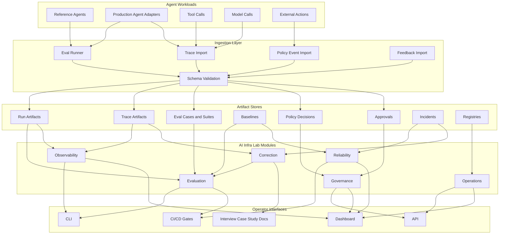

# AI Infra Lab Architecture

## Consolidation Summary

AI Infra Lab is the single unified project for the AI infrastructure portfolio.

The workspace review found:

| Project Name | Workspace Evidence | Keep As | Decision |
| --- | --- | --- | --- |
| `agent-reliability-platform` | Root `pyproject.toml`, `arp/`, `evals/`, `tests/`, `docs/CAPABILITY.md` | Current implementation slice | Keep in root as the active platform core |
| `llm-evaluation-platform` | Evaluation behavior inside `arp`: cases, suites, graders, baselines, reports | Evaluation module | Merge into AI Infra Lab |
| `agent-observability-platform` | Timing metadata, run artifacts, attempt artifacts, error capture, and first-class trace artifact validation/inspection | Observability module | Merge into AI Infra Lab as trace/run observability |
| `unify-ai-infrastructure` | Prior portfolio strategy doc | Architecture and roadmap docs | Replace with unified docs |
| `course-planner-agent` | `apps/course-planner-agent` | Reference agent only | Archive as non-core standalone app |

## Overlap Analysis

| Overlap Area | Duplicate Concern | Unified Decision |
| --- | --- | --- |
| Eval cases and suites | LLM evaluation and agent reliability both need versioned cases, suites, graders, and pass/fail evidence | One Evaluation module owns cases, suites, graders, dataset runs, and comparisons |
| Baselines and regressions | Evaluation and reliability both compare current behavior against expected behavior | Reliability uses Evaluation baselines as release gates |
| Run artifacts | Observability, evaluation, and reliability all need run status, timing, errors, and evidence | One Run Artifact schema feeds all modules |
| Traces | Observability traces and eval attempts both represent agent execution | One Trace schema with spans, tool calls, model calls, external actions, errors, cost, and latency |
| Reports | Evaluation reports, reliability reports, and incident reports can diverge | Reports are generated from shared artifacts instead of separate ad hoc formats |
| Governance | Policy enforcement can be duplicated across agents, evals, and runtime tooling | Governance owns policy decisions and approval artifacts |
| Correction loops | Eval failures, trace failures, incidents, and feedback can create separate TODO lists | Correction owns trace-to-eval, incident-to-eval, and feedback-to-eval workflows |

## Architecture Diagram



## Module Responsibilities

### Evaluation

Owns quality measurement:

- eval case schemas
- eval suite schemas
- deterministic graders
- LLM judge integration later
- baseline promotion
- regression comparison
- prompt and model comparison
- evaluation reports

Current code: `arp/schema.py`, `arp/graders.py`, `arp/runner.py`, `arp/baseline.py`, `arp/report.py`.

### Observability

Owns understanding what agents did:

- trace schema
- span and event import
- model call telemetry
- tool call telemetry
- latency and cost metadata
- run inspection
- OpenTelemetry-shaped identifiers

Current coverage: run and attempt artifacts with timing and errors, plus `arp.trace.v1` trace artifacts with spans, model calls, tool calls, external actions, errors, tokens, cost, parent span references, validation, and CLI inspection.

Missing: persisted trace import into `artifacts/traces/`, OpenTelemetry ingestion, and trace-to-eval conversion.

### Reliability

Owns dependable production behavior:

- release gates
- SLO evaluation
- retry and fallback policy modeling
- incident artifacts
- regression blocking
- failure trend reporting

Current coverage: baseline comparison, errored run capture, CLI exit codes.

### Governance

Owns risk control:

- policy schemas
- policy decisions
- approval requests
- risk scores
- external action controls
- audit records

Current coverage: none in root implementation. This is a priority gap.

### Operations

Owns lifecycle management:

- agent registry
- prompt registry
- model/provider metadata
- usage analytics
- cost tracking
- version promotion
- owner and environment metadata

Current coverage: minimal agent ID in run artifacts.

### Correction

Owns continuous improvement:

- failed-run-to-eval workflows
- trace-to-eval workflows
- incident-to-eval workflows
- feedback capture
- correction report artifacts

Current coverage: reports expose evidence, but there is no correction workflow yet.

## Single Architecture Principle

All modules should read and write shared artifacts. Avoid separate formats for evaluation, observability, governance, and reliability.

The core artifact chain should be:

```text
agent execution -> trace artifact -> run artifact -> eval result -> baseline comparison -> release gate -> incident/correction if needed
```

This is the main reason the projects should be merged.
